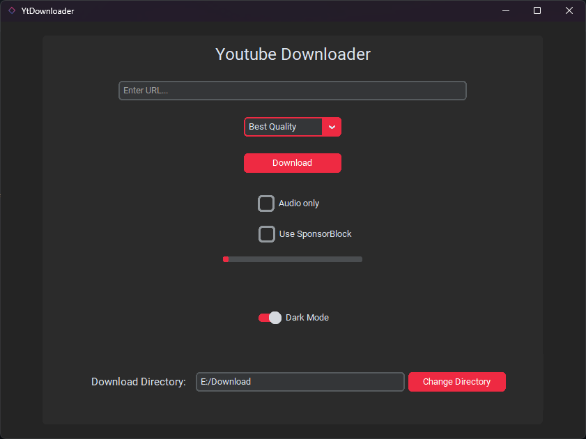
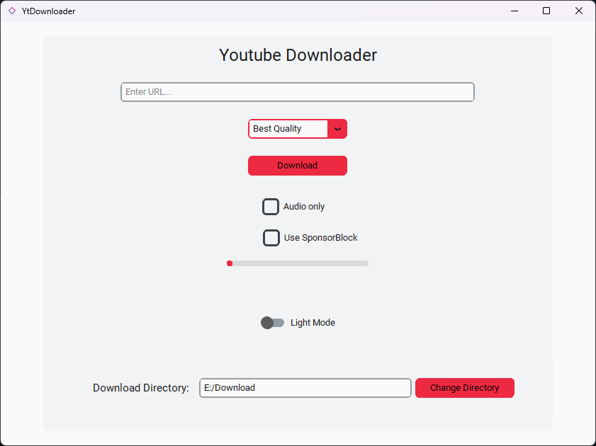

# Features
- Download Youtube videos with the highest quality possible.
- Download high quality extracted audio from the videos.
- Sponsorblock integration
- Light and Dark mode.
<br>

# Screenshots
 
<br>
<br>
> [!IMPORTANT]
> There are two versions of this app, if you want the web app version, download the repo and delete the 'YtDownloader_Desktop' folder
> 
> Or if you want only the desktop version, downloading only that folder should suffice.
>
> Don't forget to check the section for each version</span>
<br>

# YtDownloader required package

## Ffmpeg
[Download ffmpeg](https://www.gyan.dev/ffmpeg/builds/ffmpeg-git-full.7z)

### Instructions to install FFmpeg
1. Extract the zip file 
2. Copy the contents of the extracted folder
3. Navigate to the root of the C drive
4. Make a new folder "ffmpeg"

5. Paste the contents of the extracted folder into it
6. Should look like this<br>


### Instructions to add Ffmpeg to Windows PATH
1. Go to start and search for "edit the system environment variables"


2. Go to the advanced tab
3. Click "Environment Variables" button<br>


4. Select Path from the list and click Edit<br>

5. Click New and paste the location of the bin folder, Should be something like this C:\ffmpeg\bin<br>

6. Click Ok, Ok and Ok


## YtDownloader web app dependencies

## Flask
```bash
pip install flask
```
## yt_dlp
```bash
pip install yt_dlp
```
## YtDownloader desktop dependencies

## yt_dlp
```bash
pip install yt_dlp
```
## CustomTkinter
```bash
pip install customtkinter
```
